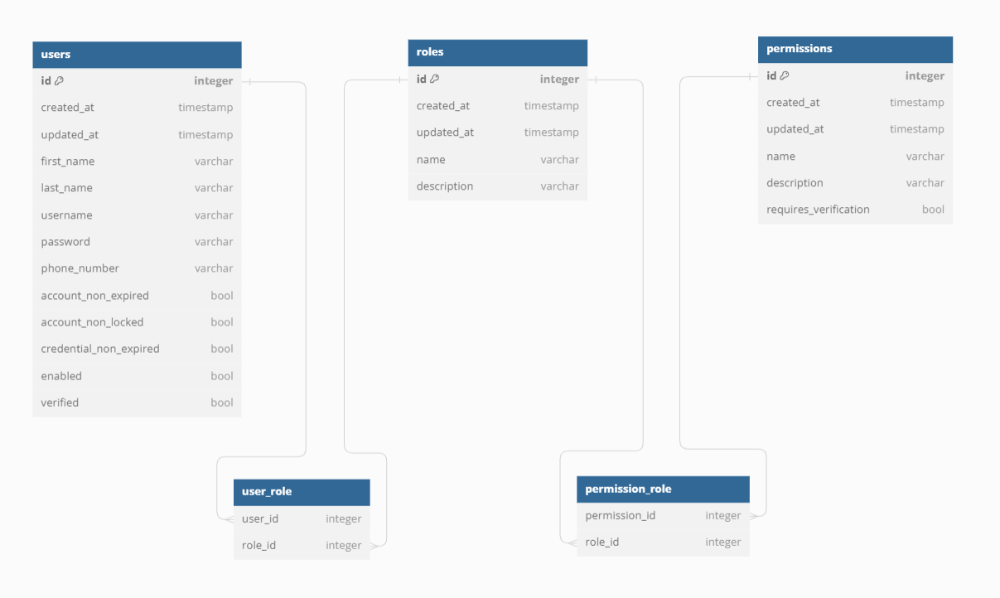

# <h2 align="center">Spring Security JWT Project Starter</h3>

<div align="center">

[]()
[](https://github.com/chijioke-ibekwe/spring-security-jwt/issues)
[](https://github.com/chijioke-ibekwe/spring-security-jwt/pulls)
[](/LICENSE)

</div>

---

<p align="center"> Spring Boot project starter code fully configured with JWT authentication and authorization, using Spring Boot 3 and Spring Security 6.
    <br> 
</p>

## 📝 Table of Contents
- [About](#about)
- [Getting Started](#getting_started)
- [Usage](#usage)
- [API Documentation](#api_docs)
- [Built Using](#built_using)
- [Authors](#authors)

## 🧐 About <a name = "about"></a>
This is a fully configured Spring Security JWT module using the new Spring Boot 3 and Spring Security 6 
frameworks. It provides spring security JWT configurations you need to quickly bootstrap your small to medium scale 
projects. This project is configured to issue self-signed JWTs which eliminate the need to introduce a standalone 
authorization server. The following features are supported:
- User registration
- User login using their username and password
- API method security with user roles and permissions

**If you find this project useful, kindly drop a star on this repo. I'd really appreciate it 🙂.**

## 🏁 Getting Started <a name = "getting_started"></a>
### Prerequisites  
To successfully use this project, you'll need the following installed on your machine:
- **JDK >= v17.** That is because this project was developed using Spring Boot 3, which requires Java 17
as a minimum version.
- **Apache Maven**
- **Docker**
- **OpenSSL**

## 🎈 Usage <a name="usage"></a>
To use this project:
1. Fork the repository

2. Clone the repository using the following command:
   ```
   git clone https://github.com/<your-git-username>/spring-security-jwt.git
   ```
3. A docker compose file is attached to this project to help you easily set up a development database. To do this,
   run the following command in your terminal from the root directory of the project
   ```
   docker compose up -d
   ```
   This command will spin-up the following containers running in a detached mode: 
   - A postgres database running on `localhost:5431`, and 
   - A pgAdmin UI running on `localhost:5050` for managing the database.

4. Using the `pgAdmin` interface or your `psql`, create a database called `spring-security-jwt`. If you wish to name 
   this database something different, make sure to update the database configuration in the `application.yml` file.

5. Generate the asymmetric keys for encrypting and decrypting the JWT, by running the `generate_keys.sh` script
   from the root directory of the project using:
   ```
   ./generate_keys.sh
   ```
   Ensure that the generated keys directory is git ignored to prevent committing them to source control
6. Lastly, run the following command to start the application, or simply run the `JwtSecurityApplication.java` class 
   via your IDE:
   ```
   mvn clean compile exec:java
   ```
   Liquibase will run the migration files within the `resources/db` directory, upon startup, to set up the database.
   The schema created will have the following structure.  
   

   Feel free to begin customizations!

## 📄 API Documentation <a name="api_docs"></a>
This project is configured with swagger for API documentation. When the application is started, visit the following link
on your browser to view the documentation for the existing APIs:
```
http://localhost:8081/swagger-ui/index.html
```

## ⛏️ Built Using <a name = "built_using"></a>
- [Spring Boot v3.2.5](https://spring.io/projects/spring-boot) - Spring Boot 3
- [PostgreSQL](https://www.postgresql.org/) - PostgreSQL Database

## ✍️ Authors <a name = "authors"></a>
- [@chijioke-ibekwe](https://github.com/chijioke-ibekwe) - Idea & Initial work