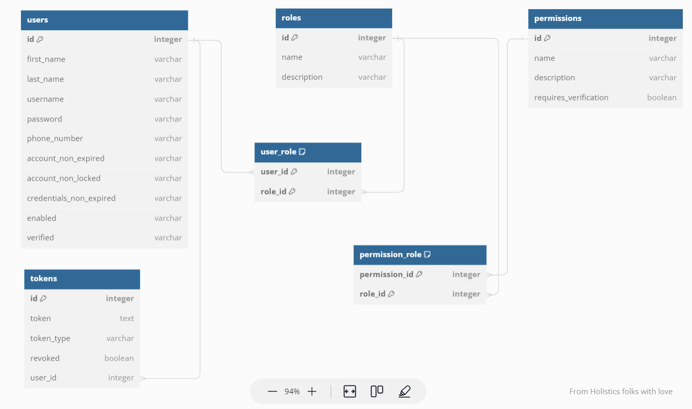

# <h2 align="center">Spring Security JWT Project Starter</h3>

<div align="center">

[]()
[](https://github.com/chijioke-ibekwe/spring-security-jwt/issues)
[](https://github.com/chijioke-ibekwe/spring-security-jwt/pulls)
[](/LICENSE)

</div>

---

<p align="center"> Spring Boot project starter code fully configured with JWT authentication and authorization, using Spring Boot 3 and Spring Security 6. Features user login, logout, token refresh and user roles/permissions
    <br> 
</p>

## 📝 Table of Contents
- [About](#about)
- [Getting Started](#getting_started)
- [Usage](#usage)
- [API Documentation](#api_docs)
- [Built Using](#built_using)
- [Authors](#authors)

## 🧐 About <a name = "about"></a>
This is a fully configured Spring Security JWT module using the new Spring Boot 3 and Spring Security 6 
frameworks. It provides all the spring security JWT starter code you need to quickly bootstrap your small to medium scale 
projects, allowing you to focus on your peculiar business logic. This project supports the following features:
- User registration
- User login using their username and password
- User token refresh using the refresh token
- User logout
- API method security with user roles and permissions

**If you find this project useful, kindly drop a star on this repo. I'd really appreciate it.**

## 🏁 Getting Started <a name = "getting_started"></a>
### Prerequisites  
To successfully use this project, you'll need the following installed on your machine:
- **JDK >= v17.** That is because this project was developed using Spring Boot 3, which requires Java 17
as a minimum version.
- **Apache Maven**
- **Docker**

## 🎈 Usage <a name="usage"></a>
To use this project:
1. Fork the repository

2. Clone the repository using the following command:
   ```
   git clone https://github.com/<your-git-username>/spring-security-jwt.git
   ```

3. A docker compose file is attached to this project to help you easily set up a development database. To do this,
   run the following command in your terminal or command prompt
   ```
   docker compose up -d
   ```
   This command will spin-up the following containers running in a detached mode: 
   - A postgres database running on `localhost:5431`, and 
   - A pgAdmin UI running on `localhost:5050` for managing the database.

4. Using the `pgAdmin` interface or your `psql`, create a database called `spring-security-jwt`. If you wish to name 
   this database something different, make sure to update the database configuration in the `application.yml` file.

5. Setup an env variable called `SECRET_KEY`. This value will be used in signing and decoding your JWT.

6. Lastly, run the following command to start the application:
   ```
   mvn clean compile exec:java
   ```
   Liquibase will run the migration files within the `resources/db` directory, upon startup, to set up the database.
   The schema created will have the following structure.  
   

Feel free to begin customizations!

## 📄 API Documentation <a name="api_docs"></a>
This project comes with the following APIs:
1. `POST '/api/v1/users'`
   - Registers a new user.
   - Body: A JSON containing the details of the user as shown below:

   ```json
   {
       "firstName": "John",
       "lastName": "Doe",
       "email": "john.doe@gmail.com",
       "password": "password",
       "phoneNumber": "+2348123456789",
       "type": "ADMIN"
   }
   ```
   - Returns: A JSON of the registered user's details.

   ```json
   {
      "status": "Successful",
      "message": "User registered successfully",
      "data": {
         "id": 1,
         "firstName": "John",
         "lastName": "Doe",
         "phoneNumber": "+2348123456789",
         "username": "john.doe@gmail.com",
         "verified": false,
         "roles": [
            {
               "id": 1,
               "name": "ROLE_ADMIN",
               "permissions": [
                  "users:read"
               ]
            }
         ]
      }
   }
   ```

2. `POST '/api/v1/auth/login'`

   - Authenticates a user
   - Body: A JSON of the user's username and password

   ```json
   {
       "username": "john.doe@gmail.com",
       "password": "password"
   }
   ```
   - Returns: A JSON of access token, token type, expires in (seconds), and a refresh token.

   ```json
   {
       "accessToken": "accessToken",
       "tokenType": "bearer",
       "expiresIn": 1800,
       "refreshToken": "refreshToken"
   }
   ```

3. `POST '/api/v1/auth/refresh'`

   - Refreshes the access token upon expiration
   - Body: A JSON of the refresh token

   ```json
   {
      "refreshToken": "refreshToken"
   }
   ```
   - Returns: A JSON of the new access token, token type, expires in (seconds), and the refresh token that was passed in.

   ```json
   {
       "accessToken": "accessToken",
       "tokenType": "bearer",
       "expiresIn": 1800,
       "refreshToken": "refreshToken"
   }
   ```

4. `POST '/api/v1/auth/logout'` - `Protected`

   - Invalidates a user's active tokens

   - Returns: A JSON of the following response 

      ```json
      {
         "status": "Successful",
         "message": "User logged out successfully",
         "data": null
      }
      ```
     
5. `GET '/api/v1/users'` - `Protected`
   - Fetches all users

   - Returns: A JSON of the registered user's details.

   ```json
   {
      "status": "Successful",
      "message": null,
      "data": {
         "content": [
              {
                  "id": 1,
                  "firstName": "John",
                  "lastName": "Doe",
                  "phoneNumber": "+2348123456789",
                  "username": "john.doe@gmail.com",
                  "verified": false,
                  "roles": [
                      { 
                          "id": 1,
                          "name": "ROLE_ADMIN",
                          "permissions": [
                              "users:read"
                          ]
                      }
                  ]
              }
         ]
      }
   }
   ```

## ⛏️ Built Using <a name = "built_using"></a>
- [Spring Boot v3.1.2](https://spring.io/projects/spring-boot) - Spring Boot 3
- [PostgreSQL](https://www.postgresql.org/) - PostgreSQL Database

## ✍️ Authors <a name = "authors"></a>
- [@chijioke-ibekwe](https://github.com/chijioke-ibekwe) - Idea & Initial work